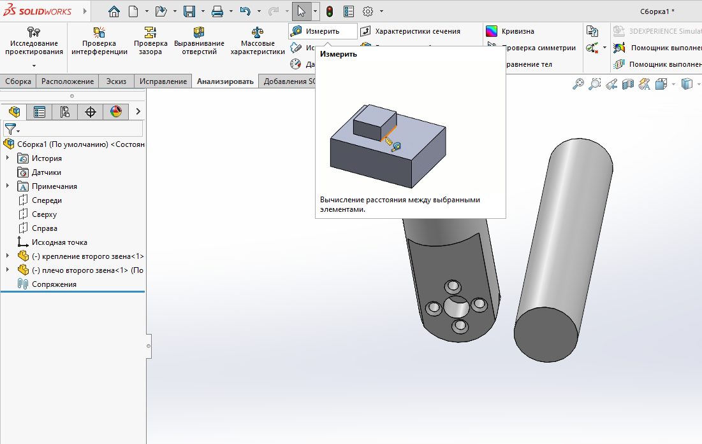
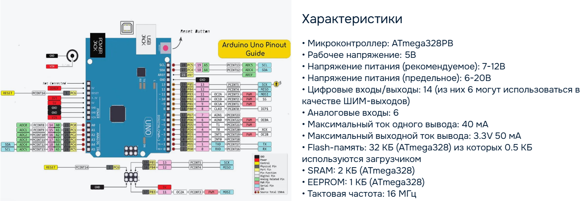
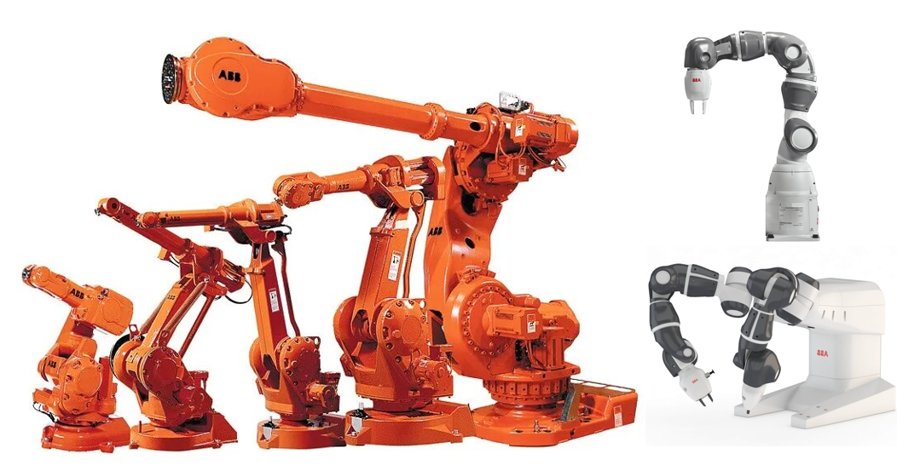
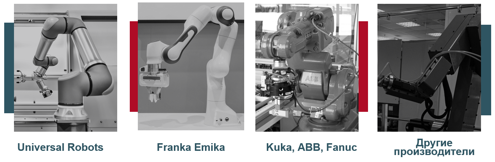

# Знакомство с форматом занятий и критериями оценивания. Обзор материалов курса. Введение в робототехнику. Промышленные и коллаборативные роботы. Этапы реализации проекта (MVP, пилотный проект, серия, последующая модернизация). Визуальное планирование (Roadmap, диаграмма Ганта, Канбан). 

## Знакомство с форматом занятий и критериями оценивания.

Курс предназначен для магистрантов, имеющих различный уровень предварительной подготовки и разную специализацию. Его основная цель — сформировать целостное представление о содержании и возможных направлениях дисциплины «Робототехника».  

Курс не предполагает замены фундаментальной подготовки уровня бакалавриата по одноимённой специальности. Вместо этого он знакомит студентов с типовыми задачами робототехники, позволяя выбрать степень вовлеченности: ограничиться ознакомительным уровнем или углубиться в решение конкретных задач.  

В течение семестра студенты выполняют ряд заданий, успешное выполнение которых является обязательным условием для допуска к зачёту и гарантирует получение итоговой оценки на зачете **не ниже 6**:  

1. **Кинематический анализ.**  
   Определение параметров Денавита–Хартенберга для индивидуального варианта. Построение итоговой матрицы преобразований. Решение прямой задачи кинематики с использованием визуализации положения звеньев манипулятора в зависимости от параметров. Построение рабочей области манипулятора с учётом ограничений. Реализация программы для решения обратной задачи кинематики на языке Python.  

2. **Проектирование в CAD-системе.**  
   Создание 3D-модели манипулятора в SolidWorks: моделирование всех необходимых деталей, сборка с использованием сопряжений, работа с конфигурациями.  

3. **Изготовление деталей.**  
   Производство всех деталей манипулятора (за исключением покупных изделий) с использованием станков с ЧПУ, предпочтительно методом 3D-печати.  

4. **Программирование и управление манипулятором.**  
   Разработка программного обеспечения для управления манипулятором. Итогом выполнения заданий 2–4 должен стать функционирующий манипулятор, соответствующий кинематической схеме индивидуального варианта и оснащённый удобным интерфейсом для управления.  

5. **Презентация и защита проекта.**  
   Подготовка отчётных материалов и защита выполненной работы.  

Для получения более высокой оценки необходимо пройти **устный зачёт**, включающий теоретические вопросы по курсу. Перечень вопросов будет предоставлен не позднее **1 декабря**.  

## Обзор материалов курса.

Для Вас подготовлен [репозиторий](https://github.com/HatsanovaEvgenia/RoboticsModule) с материалами по курсу. Материалы будут добавляться в течение семестра. Ссылки на дополнительные материалы размещены в тексте лекций для Вашего удобства.

## Календарно-тематический план курса.

| Неделя   | Даты        | Лекции и обсуждения                                                                                                                                                                                                                                                 | Практические задания                                                                                          | Домашние задания / подготовка                                                                                                                                                                                                                 | Ключевые навыки и результаты                                                                 |
|----------|-------------|----------------------------------------------------------------------------------------------------------------------------------------------------------------------------------------------------------------------------------------------------------------------|---------------------------------------------------------------------------------------------------------------|-----------------------------------------------------------------------------------------------------------------------------------------------------------------------------------------------------------------------------------------------|------------------------------------------------------------------------------------------------|
| **1**    | 01.09–07.09 | Знакомство с форматом занятий и критериями оценивания. Обзор материалов курса. Введение в робототехнику. Промышленные и коллаборативные роботы. Этапы реализации проекта (MVP, пилотный проект, серия, модернизация). Визуальное планирование (Roadmap, Гант, Канбан). | Проектирование технического облика манипулятора. Индивидуальное планирование этапов для реализации MVP. Построение roadmap и диаграммы Ганта. | Заполнение индивидуальных таблиц с указанием сроков для каждого этапа.                                                                                                                                | Понимание структуры курса. Навыки планирования проекта. Владение инструментами визуального планирования (roadmap, диаграмма Ганта, Kanban). |
| **2**    | 08.09–14.09 | Кинематический анализ. Прямая задача кинематики. Параметры Денавита–Хартенберга.                                                                                                                                                                                     | Определение параметров Д–Х для индивидуального варианта. Построение итоговой матрицы.                         | **_Предварительно:_** установка VS Code с библиотеками `sympy`, `numpy`, `matplotlib`. Визуализация решения прямой задачи кинематики. Построение рабочей области манипулятора с учётом ограничений.                                          | Владение методом Д–Х. Навыки программной визуализации прямой задачи кинематики. |
| **3**    | 15.09–21.09 | Обратная задача кинематики. Кинематическая декомпозиция. Решение ОЗК по положению и по ориентации.                                                                                                                                                                   | Программирование обратной задачи кинематики на Python.                                                         | Решение обратной задачи кинематики для своей схемы.                                                                                                                                                                                           | Навыки программирования решения обратной задачи кинематики. Понимание ограничений метода. |
| **4**    | 22.09–28.09 | Знакомство с SolidWorks. Настройка шаблонов и параметров. Эскизы. Детали.                                                                                                                                                                                            | Создание 3D-моделей всех двигателей из стартового набора электроники.                                          | **_Предварительно:_** установить SolidWorks 2023 и проверить работоспособность. Создание 3D-моделей двигателей.                                                                                                                              | Базовые навыки работы в SolidWorks. Создание эскизов и деталей. |
| **5**    | 29.09–05.10 | Приводы. Механические передачи.                                                                                                                                                                                                                                      | Проектирование шестерён первого звена манипулятора.                                                            | Сборка первого звена манипулятора.                                                                                                                                                                                                           | Понимание принципов работы механических передач. Навыки проектирования шестерён. |
| **6**    | 06.10–12.10 | Конфигурации. Сборки. Допуски.                                                                                                                                                                                                                                       | Создание моделей всех деталей первого звена манипулятора.                                                      | Сборка первого звена манипулятора.                                                                                                                                                                                                           | Навыки сборки деталей в CAD. Знания о допусках и конфигурациях. |
| **7**    | 13.10–19.10 | Самостоятельная работа.                                                                                                                                                                                                                                              | Создание сборок всех звеньев манипулятора. Проектирование схвата.                                              | Создание сборок всех звеньев манипулятора. Проектирование схвата манипулятора.                                                                                                                                                               | Навыки проектирования захватных устройств. Умение работать с многозвенными сборками. |
| **8**    | 20.10–26.10 | Технологии 3D-печати. Ресурсы для изготовления деталей.                                                                                                                                                                                                              | Запуск печати на 3D-принтере.                                                                                  | Печать (или иное изготовление) деталей манипулятора.                                                                                                                                                                                          | Владение базовыми технологиями 3D-печати. Практический опыт подготовки моделей к печати. |
| **9**    | 27.10–02.11 | Типы электродвигателей в робототехнике. Отличия плат и архитектур. Программное обеспечение для программирования манипулятора.                                                                                                                                        | Управление поворотом серводвигателя. Считывание сигналов с джойстиков.                                         | **_Предварительно:_** установка необходимого ПО (будет уточнено). Написание и отладка программы управления манипулятором.                                                                                                                     | Понимание принципов работы сервоприводов и управляющей электроники. Навыки программирования управления. |
| **10**   | 03.11–09.11 | Оформление результатов работы.                                                                                                                                                                                                                                       | Индивидуальные консультации. Реализация MVP.                                                                   | Реализация MVP.                                                                                                                                                                                                                              | Навыки интеграции разработанных компонентов в работающий прототип. |
| **11–13**| 10.11–30.11 | Индивидуальные консультации. Оформление результатов работы.                                                                                                                                                                                                          | Индивидуальные консультации. Реализация MVP.                                                                   | Реализация MVP.                                                                                                                                                                                                                              | Умение представлять проект в законченном виде. Финализация работы. |
| **14**   | 01.12–07.12 | Защита проекта.                                                                                                                                                                                                                                                      | Защита проекта.                                                                                                |                                                                                                                                                                                                                                               | Навыки презентации и защиты инженерного проекта. |

## Введение в робототехнику.

Робототехника — это междисциплинарная область науки и техники, объединяющая знания из разных дисциплин для создания, программирования и эксплуатации автоматизированных систем. Она включает в себя теоретические основы, инженерные методы и практические технологии, направленные на разработку роботов для промышленности, медицины, быта и научных исследований.

### Основные дисциплины, входящие в робототехнику.

1. **Механика и машиностроение**  
   Изучают принципы построения механических конструкций, звеньев и приводов робота. Определяют прочность, кинематику и динамику механизмов.

2. **Кинематика и динамика роботов**  
   Описывают движение манипуляторов и мобильных платформ, взаимосвязь координат звеньев и рабочих органов, расчёт усилий и траекторий.

3. **Теория автоматического управления**  
   Определяет методы стабилизации и управления движением роботов, построение регуляторов, систем обратной связи и адаптивного управления.

4. **Электротехника и электроника**  
   Обеспечивают работу приводов, датчиков, контроллеров и систем питания. Включают схемотехнику, силовую электронику и элементную базу.

5. **Программирование и алгоритмы**  
   Разработка управляющего программного обеспечения, алгоритмов планирования движения, навигации, распознавания образов и принятия решений.

6. **Компьютерное зрение и обработка сигналов**  
   Методы восприятия окружающей среды с помощью камер, лидаров, сенсоров. Включают машинное зрение, анализ изображений, обработку звука и данных.

7. **Искусственный интеллект и машинное обучение**  
   Используются для построения интеллектуальных систем навигации, адаптации к внешним условиям, распознавания объектов и взаимодействия с человеком.

8. **Мехатроника**  
   Комплексный подход, объединяющий механику, электронику, датчики и программное обеспечение в единую систему.

9. **Человеко-машинное взаимодействие (HMI)**  
   Методы организации взаимодействия робота и человека: интерфейсы управления, коллаборативные режимы, безопасность.

10. **Системная инженерия и проектирование**  
    Подход к созданию сложных робототехнических комплексов: этапы разработки, интеграция подсистем, тестирование и оптимизация.

---

Таким образом, робототехника соединяет инженерные и информационные науки, опираясь как на фундаментальные знания (математика, физика, информатика), так и на прикладные дисциплины (управление, электроника, мехатроника). Именно междисциплинарный характер позволяет развивать новые поколения роботов, способных решать всё более сложные задачи в реальном мире.

## Промышленные роботы.

Промышленные роботы — это автоматизированные технические устройства, предназначенные для выполнения производственных операций. Они применяются в промышленности для замены или помощи человеку при выполнении рутинных, тяжёлых или опасных задач.  

Основу промышленного робота составляет **манипулятор** с приводами, который управляется программируемой системой управления и может оснащаться различными инструментами и датчиками.

### Основные области применения
1. **Сварка** — например, сварка кузовов автомобилей.  
2. **Сборка** — монтаж электронных компонентов, приборостроение, бытовая техника.  
3. **Погрузочно-разгрузочные работы** — перемещение деталей, паллетирование.  
4. **Окраска и нанесение покрытий** — обеспечение равномерности и повышение безопасности.  
5. **Механическая обработка** — резка, сверление, шлифование.  
6. **Контроль качества** — визуальный контроль, сортировка, измерения.  

### Преимущества использования промышленных роботов
- Повышение производительности и качества продукции.  
- Снижение процента брака.  
- Сокращение затрат на ручной труд.  
- Повышение безопасности и улучшение условий работы.  
- Возможность круглосуточной работы без снижения эффективности.  

Таким образом, промышленные роботы являются ключевым элементом современного производства и играют важную роль в развитии промышленности, обеспечивая эффективность производственных процессов.

### Ключевые характеристики

**Грузоподъёмность**
- Сверхлёгкие — до 1 кг  
- Лёгкие — 1–10 кг  
- Средние — 10–200 кг  
- Тяжёлые — 200–1000 кг  
- Сверхтяжёлые — более 1000 кг  

**Быстродействие**
- Малое — до 0,5 м/с  
- Среднее — от 0,5 м/с до 3 м/с  
- Высокое — при больших скоростях  

**Рабочая область**
- Цилиндрическая  
- Сферическая  
- Прямоугольная  
- Плоская  
- С препятствиями  

**Степени свободы**
- 2D — с тремя степенями свободы  
- От трёх до шести  
- Шесть степеней свободы (роботы общего назначения)  
- Более шести степеней свободы (избыточные)  

**Точность**
- Малая — от 1 мм и более  
- Средняя — от 0,1 до 1 мм  
- Высокая — при меньшей погрешности  

**Тип привода**
- Гидравлический  
- Пневматический  
- Электрический  

**По способу установки**
- Стационарные  
- Горизонтальные  
- Мобильные  

### Основные вендоры манипуляторов

**Fanuc** — японская компания, производитель оборудования для промышленной автоматизации. Деятельность компании «Fanuc» сосредоточена в трёх сферах: ЧПУ и лазерное оборудование, промышленные роботы и станки.

Изделия компании используется такими производителями, как Apple, Boeing, Coca-Cola и др.

**KUKA**  одна из ведущих компаний в области промышленной робототехники и автоматизации производственных процессов. Штаб-квартира находится в городе Аугсбург, Германия. Компания основана в 1898 году и изначально занималась производством осветительных и сварочных технологий, а в 1970-е годы стала пионером в области робототехники. В 1973 году KUKA представила первого в мире промышленного робота с электрическим приводом и шестиосевой кинематикой (Famulus). Сегодня KUKA — это глобальный лидер в области автоматизации, активно работающий в Европе, Азии и Америке.

**ABB** — международная корпорация со штаб-квартирой в Цюрихе (Швейцария), один из мировых лидеров в области электротехники, энергетики, автоматизации и промышленной робототехники. Компания образована в 1988 году. В 1974 году компания представила одного из первых в мире полностью электрических роботов — IRB 6. ABB входит в тройку крупнейших производителей промышленных роботов в мире наряду с KUKA и FANUC. Компания активно развивает направление «умных фабрик» и внедряет робототехнические решения в самые разные отрасли — от автомобилестроения до медицины.

## Коллаборативные роботы.

Это промышленные роботы, которые спроектированы для безопасного взаимодействия с людьми и могут работать рядом с ними без необходимости в защитных  ограждениях. 

Эти роботы оснащены различными сенсорами (например, датчиками силы и момента), которые позволяют им чувствовать контакт с окружающей средой и безопасно взаимодействовать с людьми, останавливаясь или изменяя свои действия при обнаружении препятствий.

Они также могут проводить измерения, проверять параметры и выявлять дефекты, что помогает повысить общую надежность сварочного процесса.

### Ключевые характеристики

- **Тоже деление, что и у промышленных манипуляторов**, но еще:

- **По уровню безопасности**
    - Контролируемая остановка  
    - Контроль скорости и безопасного расстояния  
    - Ограничение мощности и усилия  

- **По функциональности**
    - Универсальные манипуляторы  
    - Специализированные манипуляторы  

## Рабочие органы манипуляторов.

**Рабочий орган манипулятора** — это конечный элемент (инструмент), с помощью которого робот выполняет целевое действие: захват, обработку или взаимодействие с объектами.  
Выбор рабочего органа зависит от выполняемой технологической задачи и свойств объектов (массы, формы, материала).

### Инструментальные рабочие органы.
Используются для технологических операций.  
- Сварочные горелки.  
- Манипуляторы с краскопультами.  
- Режущие инструменты.  
- Паяльные и термические инструменты. 
- Медицинские инструменты. 

### Захваты (грипперы, схваты).
Предназначены для удержания и перемещения объектов.  
- **Механические захваты** — с параллельными или поворотными пальцами.  
- **Пневматические и гидравлические** — обеспечивают сильное и быстрое сжатие.  
- **Вакуумные присоски** — для листовых материалов, коробок, стекла.  
- **Магнитные захваты** — для металлических деталей.  
- **Адаптивные (гибкие)** — повторяют форму объекта, применяются для неровных поверхностей и мягких материалов.  

#### Классификация захватов.

**Тип зажимного механизма**
- Механические  
- Вакуумные  
- Магнитные  
- Пневматические  
- Бионческие  

**Тип захвата (принцип)**
- Зажимной  
- Поддерживающий  
- Притягивающий  

**Тип кинематической схемы**
- Поступательная кинематика  
- Вращательная кинематика  
- Гибкая кинематика  

**Тип захвата относительно детали**
- За наружную поверхность  
- За наружную поверхность в двух сечениях  
- За внутреннюю поверхность  
- За два торца  
- По одной из поверхностей  

**Степень захвата**
- Схваты с полным захватом  
- Схваты с частичным захватом  
- Регулируемые схваты  
- Адаптивные схваты  

**Точность**
- Малая (±0,5 мм до ±2,0 мм)  
- Средняя (±0,1 мм до ±0,5 мм)  
- Высокая (±0,01 мм до ±0,1 мм)  
- Манометрическая (обеспечивается сторонним средством измерения)  

### Ключевые характеристики объектов манипулирования

**Состояние**  
- Хрупкий  
- Упругий  
- Пластичный  
- Жёсткий  

**Форма**  
- Плоская  
- Удлинённая  
- Объёмная  
- Сложной формы  
- С отверстием  

**Подвижность**  
- Подвижный  
- Неподвижный  

**Ориентированность**  
- Ориентирован  
- Не ориентирован  

**Фиксированность**  
- Жёсткофиксированный  
- Не фиксированный  

### Типы зажимных механизмов

**1. Пневматический схват** — это устройство, использующее сжатый воздух для захвата и перемещения объектов.

> **Преимущества пневматических схватов:**
> - Скорость: Пневматические системы обычно работают быстрее, чем электрические аналоги, что позволяет повышать производительность
> - Простота конструкции: Пневматические схваты имеют меньше движущихся частей, что может уменьшить вероятность поломок
> - Легкость: Пневматические системы часто легче электрических, что может быть преимуществом в некоторых приложениях
> 
> **Недостатки пневматических схватов:**
Зависимость от источника сжатого воздуха: для работы пневматического схвата необходим компрессор, что может ограничивать его мобильность и требовать дополнительного обслуживания.

**2. Механический схват**
> **Механический схват** - это устройство, предназначенное для захвата и перемещения объектов с помощью механических компонентов.
> 
> **Преимущества механических схватов:**
> - Простота конструкции: Механические системы часто имеют простую конструкцию, что делает их надежными и легкими в обслуживании.
> - Способность работать в сложных условиях: Они могут быть более устойчивыми к загрязнениям и экстремальным.
> 
> **Недостатки механических схватов:**
> - Меньшая скорость работы: Механические системы могут быть медленнее по сравнению с пневматическими или электрическими аналогами.

**3. Магнитный схват**
> Обычно такие устройства применяются для перемещения металлических предметов, таких как листы металла, трубы и другие детали. **Магнитные схваты** работают на основе электромагнитов, при подаче электрического тока создается магнитное поле, которое притягивает металлические объекты. Когда ток отключается, магнитное поле исчезает, и объект можно легко освободить.
> 
> **Преимущества магнитных схватов:**
> - Эффективность: Позволяют быстро и безопасно перемещать тяжелые предметы
> - Универсальность: Могут использоваться с различными формами и размерами металлических объектов
> 
> **Недостатки магнитных схватов:**
> - Ограничение по материалу: Не работают с неметаллическими или неферромагнитными материалами.

**4. Вакуумный схват**
> **Вакуумный схват** — это устройство, предназначенное для захвата и перемещения объектов с помощью разности давления.
> 
> **Преимущества вакуумных схватов:**
> - **Универсальность:** Могут использоваться для различных материалов и форм, особенно гладких и плоских
> 
> **Недостатки вакуумных схватов:**
> - **Ограничения по поверхности:** Неэффективны на неровных или пористых поверхностях, где невозможно создать достаточный вакуум
> - **Необходимость в обслуживании:** Требуют регулярного обслуживания насосов и присосок для поддержания эффективности

### Аспекты выбора схвата.
Схват и манипулятор должны быть совместимы по следующим критериям:

- По условиям эксплуатации
- По совместимости конструктивных разъемов
- По возможность прокладки проводов и пневматических (гидравлических) линий
- По прочностным расчетам
- По совместимому интерфейсу
- По потребности в ремонте и обслуживании

Использование **специализированного схвата** для робота-манипулятора может быть необходимым в нескольких ситуациях, когда стандартные решения не подходят:

- Уникальные формы и размеры объектов
- Специфические условия эксплуатации
- Необходимость в адаптивности (разнообразие объектов манипулирования)
- Специальные требования к сенсорике
- Обеспечение требуемой производительности

## Задачи в робототехнике.

### Задача загрузки-выгрузки.

Загрузка-выгрузка это одна из сфер активного применения промышленных роботов. Задача загрузки-выгрузки связана с перемещением заготовок, деталей или готовых изделий между различными технологическими позициями: станками, транспортными системами, складами. Для осуществления операции загрузки-выгрузки используются манипуляторы, планарные роботы и другие средства роботизации.  И каждый из видов представляет целый класс устройств. 

Планарные роботы подходят для быстрого перемещения и упаковки товаров в двумерном пространстве.

Манипуляторы с шестью степенями, обладая большей свободой движений, используются для более сложных задач в трехмерном пространстве, таких как сборка. 

#### Особенности роботизированной загрузки-выгрузки

- **Автоматизация рутинных процессов**  
   Робот берёт заготовку со склада или транспортёра, загружает её в станок (токарный, фрезерный, пресс и др.), а после обработки выгружает готовую деталь.  

- **Гибкость в работе**  
   Современные роботы могут работать с деталями разного размера и формы, используя сменные захваты и адаптивные манипуляторы.  

- **Высокая скорость и точность**  
   Роботы обеспечивают стабильную подачу заготовок, что сокращает время простоя оборудования и повышает производительность.  

- **Интеграция с системами ЧПУ и транспортными линиями**  
   Роботы взаимодействуют с автоматизированными станками, конвейерами, складскими модулями, что позволяет выстраивать непрерывные производственные цепочки.  

- **Повышение безопасности**  
   Исключается участие человека в опасных операциях (например, при работе с горячими или тяжёлыми заготовками).  

### Задача сварки.

Сварка это одна из сфер активного применения коллаборативных роботов. Она применяется в автомобилестроении, машиностроении, авиастроении и других отраслях, где требуется высокая точность, повторяемость и качество соединений. 

#### Особенности роботизированной сварки
- **Программируемые траектории**: робот может выполнять сложные пространственные движения, следуя заданным контурам.  
- **Стабильность параметров**: одинаковая сила тока, скорость подачи проволоки, давление электродов обеспечивают равномерное качество шва.  
- **Использование датчиков и систем контроля**: камеры, лазеры и датчики тока позволяют адаптировать процесс в реальном времени.  
- **Интеграция с автоматизированными линиями**: роботы-сварщики легко встраиваются в конвейерные системы.  

## Этапы реализации проекта (MVP, пилотный проект, серия, модернизация).

### MVP (Minimum Viable Product) 
 — минимально жизнеспособный продукт, то есть самая простая версия робота или его подсистемы, в которой реализован только базовый функционал. **Цель MVP** — проверить основную идею, продемонстрировать работоспособность ключевых решений и собрать обратную связь, прежде чем переходить к сложной и дорогой доработке.

**Роль MVP в проектировании робота:**  
- позволяет превратить концепцию в работающий прототип.  
- на раннем этапе не тратятся усилия на второстепенные детали.  
- MVP показывает, решает ли робот поставленную задачу.  
- постепенно добавляются новые функции и улучшения.  

**Зачем студентам  нужен MVP:**
- Чтобы практически понять процесс перехода от идеи к рабочему прототипу.  
- Чтобы научиться планировать этапы разработки и распределять ресурсы.  
- Чтобы не перегружать проект сразу всеми функциями, а двигаться по шагам.  
- Чтобы сформировать навык презентации прототипа заказчику или команде.   

Таким образом, MVP — это отправная точка в создании проекта: от минимального рабочего решения к полноценному робототехническому комплексу.

### Пилотный проект

— это этап разработки, на котором минимально жизнеспособный продукт (MVP) дорабатывается до уровня, позволяющего протестировать его в условиях, близких к реальной эксплуатации. В отличие от MVP, пилотный проект не просто демонстрирует идею, а показывает, как робот или система будет работать в производственной или учебной среде.  

**Основные особенности пилотного проекта:**  
- Усовершенствование прототипа — добавление функций, повышение надёжности и стабильности работы.  
- Тестирование в условиях, приближённых к реальности — проверка работы робота на конкретных задачах, например, в учебной лаборатории или на производственном участке.  
- Оценка эффективности — анализ производительности, скорости и точности работы.  
- Обратная связь — сбор отзывов пользователей, преподавателей или операторов, которые взаимодействуют с системой.  
  

Таким образом, **пилотный проект** — это переходный этап от простого прототипа к полноценному решению, на котором проверяется применимость разработанного робота в реальной практике.

### Пример этапов разработки робота:
1. Идея: создать робота, который сортирует объекты по цвету.  
2. MVP: простейший робот с камерой и захватом, сортирующий только два цвета (например, красный и синий).  
3. Пилотный проект: добавляется сортировка по 4–5 цветам, оптимизируется конструкция, повышается скорость.  
4. Серийная версия: робот получает модуль машинного зрения, сортирует по цвету и форме, интегрируется в конвейер.  
5. Модернизация: расширение функционала (распознавание дефектов, удалённое управление).  