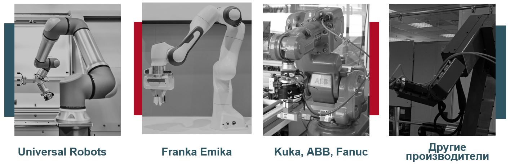

# Конфигурации. Сборки. Допуски.
## Конфигурации.

**Конфигурации** деталей в SolidWorks — это инструмент, позволяющий создавать различные варианты одной и той же модели в рамках одного файла. С помощью конфигураций пользователь может изменять размеры, подавлять или активировать элементы, заменять компоненты и задавать различные параметры, не создавая отдельные файлы для каждой модификации. Это особенно удобно при проектировании изделий с вариативными характеристиками, например, серийных деталей с разными размерами. Представьте, что Вам нужно перенести все ГОСТированные варианты винтов диаметром до 8 мм, если для каждого винта создавать отдельный файл с моделью и чертежом, то работа представляется внушительная. К тому же, если Вы вставили одну модель винта, а потом ее предстоит заменить на другую, то могут сломаться сопряжения и их нужно будет настраивать вручную.

Предположим, необходимо сделать шайбы для резьбовых соединений диаметром от 1,0 мм до 5 мм, которые бы соответствовали ГОСТ 11371-78 исполнению 2. Открываем ГОСТ и видим: 

Отрисовываем первую конфигурацию с d = 1.

Здесь особенно важно корректно называть все размеры. Далее переходим в **Вставка** -> **Таблицы** -> **Таблица параметров Exсel**

Теперь открывается окно:

Нажимаем на зеленую галочку. Всплывает еще одно окно. В нем выбираем все размеры и нажимаем **Ок**.

Теперь, если кликнуть в любом месте кроме таблицы, она закроется. Но снова открыть ее можно будет через окно **Конфигурации** слева:

Открываем таблицу через **Редактировать в новом окне**.

Во всплывшем окне выбираем все нужные нам параметры, после чего нажимаем **Ок**.

Вот как выглядит сейчас эта таблица (поменяйте, где нужно формат ячеек на числовой):

Теперь добавляем все конфигурации согласно ГОСТ.

Когда мы добавили данные для всех интересующих нас конфигураций,  закрываем таблицу, а в появившемся окне кликаем на **Ок**

Теперь, у нас в конфигурациях все они отображаются. Проверяем, что все построились корректно и, находясь на любой конфигурации, кроме конфигурации "По умолчанию", удаляем конфигурацию "По умолчанию".

Теперь все готово.

## Сборки.

В практике №6 мы уже использовали сборки в SolidWorks как вспомогательный инструмент, но в рамках этой лекции мы сделаем фокус на этом инструменте. Создаем новый документ и в начальном окне выбираем **Сборку**. Перед нами открывается окно:

Здесь нам предлагают выбрать детали из которых будет состоять наша сборка. Пока мы ничего добавлять не будем, а рассмотрим возможности, которые нам предоставляет SW. 

Когда нам понадобится вставить детали мы сможем открыть панель **Сборка** и выбрать **Вставить компонент**. Давайте вставим два компонента:

Та деталь, которую мы вставили первым у нас отображается значком (ф) - это значит, что она автоматически жестко зафиксирована в пространстве сборки. Она фиксируется ровно в том положении в котором мы ее вставили и не всегда оно корректно. В дереве построений кликаем ПКМ по первой детали и выбираем **освободить**. Теперь обе детали помечены (-) - это значит, что они не закреплены или не полностью закреплены. Выбираем одну из деталей и накладываем на нее сопряжения.

Вкладку сопряжения можно открыть из панели **Сборка** и выбрать **Условия сопряжения**. Здесь три основные вкладки: 
- Стандартные
- Дополнительные
- Механические

Перед дальнейшем изучением сборок посмотрите какие есть типы сопряжений и закрепите первую деталь сборки так, как Вы считаете корректным для удобства последующей работы с ней. 

Далее есть возможность, как и в деталях, создавать **Массивы элементов**. Иногда это очень удобно, но нужно делать это аккуратно,  чтобы при физической сборке деталей не обнаружились бы геометрические несоответствия.

Следующим разделом, о котором стоит упомянуть, являются **Элементы сборки**. Эти отверстия, фаски, скругления и т.д. можно добавлять в сборку, но с поправкой, что в деталях эти изменения не будут отражены. 

**Справочная геометрия** - очень полезный инструмент, который позволяет добавлять разные геометрический объекты, которые в последствие можно использовать для добавления, например, сопряжений.

Остальные функции этого раздела, на первых этапах работы, встречаются реже. Дополнительную информацию можно посмотреть в официальной документации SW.

Следующий раздел который мы обсудим - это **Анализировать**. Здесь нас интересуют две функции: **Массовые характеристики** и **Измерить**

**Измерить** нам пригодится для измерения каких-либо размеров в сборке.

Во время измерения важно следить, чтоб было выбрано именно то расстояние, которое нужно измерить. Также видно, что расстояние может рассматриваться в трех проекциях, если выбрана соответствующая настройка:

Так же есть всплывающее окно:

**Массовые характеристики** полезны если нужно будет анализировать динамику изделия, или если нужно приблизительно определить массу. Почему приблизительно? Потому что материал чаще всего описан приблизительно, но для первого приближения этот метод подходит.

Также хотелось бы отметить, что идеологически корректно настраивать только те сопряжения, которые будут реализуемы физически, а все остальные оставлять только временными.

Функцией, которая заслуживает Вашего внимания и самостоятельного изучения является **Исследование движения**. Эта функция позволит Вам анимировать сборку с учетом сопряжений.

## Необходимость допусков при подготовке деталей для 3D-печати и лазерной резки

При проектировании деталей для **аддитивного производства (3D-печать)** и **лазерной резки** важно учитывать **допуски** — зазоры и отклонения размеров, которые обеспечивают корректную сборку и функционирование изделия.  

### Почему нужны допуски?
1. **Технологические особенности оборудования**  
   - 3D-принтеры имеют ограниченную точность позиционирования (обычно ±0,1–0,3 мм).  
   - Лазерные резаки создают **ширину реза (kerf)** — обычно 0,1–0,2 мм, которая "съедает" часть материала.  

2. **Свойства материала**  
   - Пластик при 3D-печати может **усаживаться** при охлаждении, особенно ABS.  
   - Дерево, акрил или металл при лазерной резке могут нагреваться и деформироваться.  

3. **Функциональные зазоры**  
   - Для сборных конструкций необходимо предусматривать **минимальные зазоры**, чтобы детали не заклинивали.  
   - При подвижных соединениях нужен больший зазор для компенсации трения.  

### Практические рекомендации
- Для **3D-печати**:
  - Оставляйте зазоры 0,2–0,5 мм для неподвижных соединений (например, вставки).  
  - Для подвижных соединений (ось, шарнир) — не менее 0,5 мм.  
  - Проверяйте размер отверстий: они часто печатаются меньше расчетного диаметра.
  - Напечатайте две детали без зазоров и проверьте как они собираются.

- Для **лазерной резки**:
  - Учитывайте ширину реза (kerf). Если лазер "съедает" 0,15 мм, то размер отверстия увеличится на 0,3 мм по диаметру.  
  - Для плотных соединений ("шип-паз") оставляйте зазор 0,1–0,2 мм, чтобы детали собирались вручную.  
  - Для подвижных соединений увеличивайте зазор до 0,3–0,5 мм.  

### Вывод
**Допуски — обязательное условие точного изготовления и сборки деталей.**  
Игнорирование этого правила может привести к тому, что готовые элементы не подойдут друг к другу, будут слишком хрупкими или вовсе непригодными для использования.

## Типы соединений деталей

При проектировании и изготовлении изделий важно учитывать способы соединения деталей. От выбора типа соединения зависят прочность конструкции, возможность демонтажа и область применения.

### 1. Соединения в натяг
- **Описание:** детали подгоняются с минимальным зазором или даже с небольшим превышением размера (интерференцией).  
- **Особенности:** соединение достигается за счет силы трения и деформации материала.  
- **Примеры:** посадка вала в подшипник, втулки в отверстие.  
- **Плюсы:** высокая прочность, надежность.  
- **Минусы:** требуется высокая точность изготовления, сложно разбирать.

### 2. Сборно-разборные соединения
- **Описание:** обеспечивают возможность многократной сборки и разборки без потери качества.  
- **Примеры:** винтовые, болтовые, штифтовые, замковые соединения, "шип–паз".  
- **Плюсы:** удобство обслуживания и ремонта.  
- **Минусы:** при большом количестве соединений снижается жесткость конструкции.

### 3. Клеевые соединения
- **Описание:** скрепление деталей при помощи клеевых составов (эпоксидные смолы, все возможные клеевые составы и др.).  
- **Плюсы:** простота выполнения, возможность соединения разнородных материалов.  
- **Минусы:** низкая термостойкость, трудность разборки.

### 4. Сварные соединения
- **Описание:** детали соединяются путем местного расплавления и последующего затвердевания материала.  
- **Плюсы:** высокая прочность, герметичность.  
- **Минусы:** невозможность разборки, тепловое воздействие может изменять свойства материала, не все материалы можно соединить подобным образом, нужен навык и оборудование.

### 5. Паяные соединения
- **Описание:** детали соединяются при помощи расплавленного припоя, температура плавления которого ниже, чем у основного материала.  
- **Примеры:** электроника, медные трубопроводы.  
- **Плюсы:** возможность соединения тонких и мелких элементов.  
- **Минусы:** ограниченная механическая прочность.

### 6. Заклепочные соединения
- **Описание:** скрепление деталей с помощью заклепок.  
- **Плюсы:** надежность, простота.  
- **Минусы:** трудоемкость, невозможность разборки без разрушения заклепки.

### 7. Магнитные и фиксаторы
- **Описание:** использование магнитов, пружинных фиксаторов, клиньев.  
- **Плюсы:** удобство быстрой сборки и разборки.  
- **Минусы:** ограниченная прочность, зависимость от условий эксплуатации.

