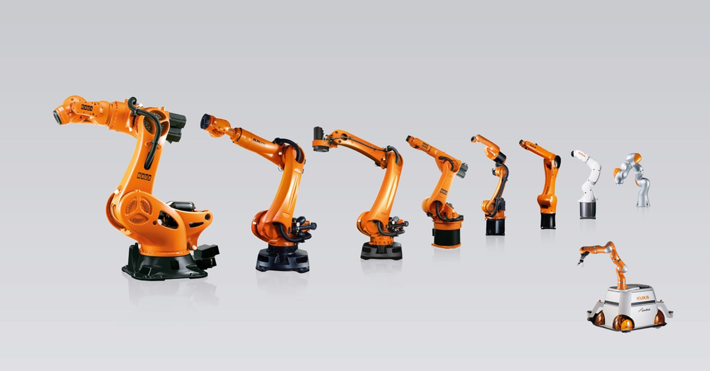

# Знакомство с Arduino

**Arduino** — это небольшая управляющая плата с собственным процессором и памятью. Помимо них на плате есть пара десятков контактов, к которым можно подключать всевозможные компоненты: светодиоды, датчики, моторы, чайники, роутеры, магнитные дверные замки и вообще всё, что работает от электричества.

В процессор Ардуино можно загрузить программу, которая будет управлять всеми этими устройствами по заданному алгоритму.

Платформа Arduino приобрела бешеную популярность благодаря простоте и дружелюбности. Даже полный ноль в программировании и схемотехнике может освоить основы работы с Ардуино за пару часов. Этому способствуют тысячи публикаций, учебников, заметок в интернете и отличная серия видеоуроков по Arduino на русском языке.

Для удобной работы с платами Ардуино существует бесплатная официальная среда программирования Arduino IDE, работающая под Windows, Mac OS и Linux. С помощью неё загрузка новой программы в контроллер становится делом одного клика, только лишь подключите плату к компьютеру через USB. Хотя для более пытливых умов возможна работа и через Visual Studio, Eclipse, другие IDE или командную строку.


По краям платы находятся пины, в которые можно вставлять провода. Они все подписаны. С одной стороны идут цифровые выводы от 0 до 13 и GND, с другой стороны аналоговые выводы от A0 до A5 и GND (2 шт.), 5V, 3.3V. Запомните их расположение, оставшиеся выводы используются гораздо реже, особенно на начальном этапе. 

Обратите внимание, что аналоговые выводы на самом деле являются цифровыми и их можно использовать в таком качестве, если вам не хватило стандартных выводов от 0 до 13. Поэтому аналоговые выводы можно представлять как 14, 15, 16, 17, 18, 19 вместо A0, A1, A2, A3, A4, A5.

Аналоговые и цифровые выводы могут принимать цифровой сигнал. Цифровым сигналом называют последовательность нулей и единиц от скачков напряжения от 0 до 5 вольт. Вдобавок, аналоговые выводы могут принимать аналоговые сигналы - диапазон плавно изменяющего напряжения от 0 до 5 вольт с маленьким шагом.




Выделяют два основных вида серводвигателей – с непрерывным вращением и с фиксированным углом  (чаще всего, 180 или 270 градусов). Отличие серво ограниченного вращения заключается в механических элементах конструкции, которые могут блокировать движение вала вне заданных параметрами углов. Достигнув угла 180, вал окажет воздействие на ограничитель, а тот отдаст команду на выключение мотора. У серводвигателей непрерывного вращения таких ограничителей нет.


Основная библиотека для управлением сервами:

```
#include <Servo.h>
```

Создаём четыре объекта Servo — каждый представляет один сервопривод
```
Servo servo1; // скорость
Servo servo2; // угол
Servo servo3; // скорость
Servo servo4; // угол
```

Подключаем каждый сервопривод к своему пину Arduino
```
// Подключаем сервы
  servo1.attach(2);
  servo2.attach(4);
  servo3.attach(3);
  servo4.attach(5);
```


Позиционные серводвигатели поворачиваются на заданный угол (обычно от 0° до 180°).
Внутри находится потенциометр, который позволяет контроллеру точно удерживать положение.

Команда servo.write(angle) задаёт угол поворота.

```
#include <Servo.h>

Servo servo;  // создаём объект сервопривода

void setup() {
  servo.attach(2);  // подключаем серво к пину 2
}

void loop() {
  servo.write(0);    // повернуть на 0°
  delay(1000);
  servo.write(90);   // повернуть на 90°
  delay(1000);
  servo.write(180);  // повернуть на 180°
  delay(1000);
}

```


Серводвигатели постоянного вращения вращаются непрерывно и управляются сигналом:

servo.write(90) — стоп

servo.write(<90) — вращение в одну сторону

servo.write(>90) — вращение в другую сторону

Чем дальше значение от 90, тем выше скорость

```
#include <Servo.h>

Servo motor;  // создаём объект для постоянного вращения

void setup() {
  motor.attach(3);  // подключаем мотор к пину 3
}

void loop() {
  motor.write(0);    // вращение в одну сторону (макс. скорость)
  delay(2000);
  motor.write(90);   // остановка
  delay(1000);
  motor.write(180);  // вращение в другую сторону (макс. скорость)
  delay(2000);
  motor.write(90);   // остановка
  delay(1000);
}
```