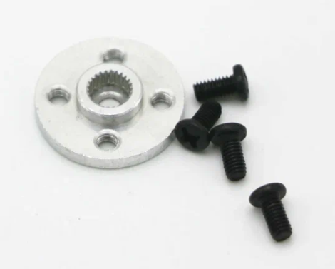

# Знакомство SolidWorks. Настройка шаблонов и параметров. Эскизы. Детали.

Перед практическим занятием прошу установить **SolidWorks (SW) 2024** года. В рамках данного курса мы будем работать именно с этой программой и, даже если вы умеете работать в аналогичных ей (Компас, Inventor итд), на этом курсе будут приниматься только работы выполненные в ней. Почему именно 2024 года: важно, чтоб все мы пользовались одной версией, иначе могут возникать конфликты при открытии файлов. Файл для установки лежит в этой папке и называется SolidWorks2024.torrent. Внимательно прочитайте Readme перед установкой. Вам не обязательно ставить все пакеты, советую посмотреть описание, какой функционал дает какой модуль и ставить либо необходимые, либо заинтересовавшие Вас.

В прошлом веке обязательным атрибутом конструктора были кульман и карандаш, сейчас это компьютер и САПР. САПР - Система автоматизированного проектирования, в которой можно выделить три группы программного обеспечения: CAD (computer-aided design), CAM (computer-aided manufacturing) и CAE(computer-aided engineering). CAD помогает создавать модели, конструкторскую и текстовую документацию. CAE помогает проводить расчеты: потоков, нагрузки, литья итп. CAM помогает конвертировать параметры модели в код станка с ЧПУ (числовым программным управлением). Зачем нужны САПР продукты? Они помогают предотвратить ошибки на этапе проектирования изделия, конструктор может посмотреть как будут взаимодействовать между собой детали изделия и проверить корректность их взаимодействия. Использование САПР ПО не является гарантией исправности результата, но значительно облегчает процесс разработки.

Разберем на примере. В рамках данного курса Вы будете проектировать и изготавливать детали на 3D принтере. Предположим, что вы спроектировали два разных исполнения одной детали - этот этап проектирования относится к CAD системе. Теперь, чтоб выяснить: какое из исполнений предпочтительнее, Вы проводите расчет на изгиб (допустим) - этот этап относится к CAE. После сравнения результатов расчетов деформации при изгибе, Вы выбрали одно из исполнений, и чтобы напечатать его на 3D принтере используете программу, которая сформирует G-код (условное именование языка программирования устройств с ЧПУ), чтоб 3D принтер знал как эту деталь напечатать - это CAE этап.

Мы будем использовать SW только для проектирования робота-манипулятора, хотя возможности которые предоставляет ПО значительно шире. Сегодня мы только начнем знакомство с программой.

## Настройка шаблонов и параметров

Для комфортной работы с программой, необходимо предварительно настроить ее. Это нужно будет сделать только один раз, но это крайне важно для корректного отображения размеров при экспорте файлов, соответствию ГОСТ и удобству в случае командной работы над проектом.

Вот гайды, которые могут Вам помочь: 

- https://3ddd-engineering.ru/pervyy-zapusk-solidworks/

- https://3ddd-engineering.ru/nastroyki-chertezha-solidworks-po-gost-eskd/

- https://3ddd-engineering.ru/nastroyki-chertezha-solidworks-po-gost-eskd-n2/

Познакомимся с настройками пользователя, сейчас мы менять их не будем, но отметим, что они в основном влияют на отображение, производительность и способы ввода, также в них находятся пути к форматкам (об этом чуть позже). Открываем SW, перед нами всплывает окно:

 

Открываем **Настройки пользователя** (шестеренка на панели команд)

 

 Тут во вкладках **Месторасположение файлов** и  **Шаблоны по умолчанию** находятся интересующие нас пути: 
 
  

 Сейчас шаблоны по умолчанию пусты и нам нужно это исправить. Для этого закрываем **Настройки пользователя** и открываем приветственное окно, для этого можно нажать CTRL + F2:

 

В приветственном окне кликаем на кнопку "Дополнительно"

В появившейся вкладке выбираем "gost-part drw". Перед нами вылетает всплывающее окно **Формат листа/Размер**. Нужно нажать **отмена**. И **отмена** на вкладке слева **Вид модели**.

Теперь открываем **Настройки пользователя** и во вкладках наверху выбираем **Свойства документа**. 
. Сейчас выбран формат по-умолчанию ГОСТ-ИЗМЕНЕН, мы на его базе создадим свой и будем его использовать. Если какой-то раздел не требует изменений, то про него ничего не написано.

В качестве шрифта (вкладка **примечания**) выбираем **Calibri**. Можно установить отдельно шрифты ГОСТ А и ГОСТ Б, но у них могут возникать проблемы при совмещении с Windows. Далее будут приведены скриншоты, выставляйте параметры в соответствии с ними. 

Вкладка **Позиции**

Вкладка **Заметки**

Вклада **Шероховатость поверхности**

Раздел **Размеры**

Нажимаем на кнопку "Допуск"

Вкладка **Диаметр**

Раздел **Осевые линии/ Указатели центра**

Раздел **Таблицы** меняем шрифт

Раздел **Виды** меняем шрифт

Вкладка **Вспомогательный** 

Вкладка **Местный**

Вкладка **Сечение**

Раздел **Детализация**

Раздел **Единицы измерения**

Теперь сохраним получившийся шаблон. Переходим во вкладку **Чертежный стандарт**, нажимаем на кнопку «Сохранить во внешнем файле…» присваиваем имя и нажимаем сохранить.

Теперь сделаем так, чтоб эти настройки автоматически применялись к новым файлам деталей и сборок (как доделать шаблон чертежа можно посмотреть здесь: https://3ddd-engineering.ru/sozdaem-shablon-chertezha-po-gost-eskd-v-solidworks/, но мы не будем оформлять конструкторскую документацию на наш проект, так что это останется на Ваше усмотрение).

Открываем приветственное окно в режиме "Дополнительно"

Выбираем иконку gost-part и открываем **Параметры**

В разделе **Свойства документа** во вкладке **Чертежный стандарт** нажимаем кнопку **Загрузить из внешнего файла** и открываем тот документ с расширением .sldstd, который мы сохраняли ранее.

Далее нажимаем ОК. Теперь сохраним новый файл шаблона детали. Для этого нажимаем **Файл** -> **Сохранить как** и выбираем формат **Part templates**

Теперь открываем **Параметры** -> **Настройки пользователя** -> **Месторасположение файлов** и добавляем путь до той папки, в которую мы только что сохранили два документа "ГОСТ.sldstd"

После чего, в разделе **Шаблоны по умолчанию**, в пути для детали выбираем путь до созданного файла "Деталь.sldstd". Нажимаем "ОК".

Открываем приветственное окно в режиме "Дополнительно"

Выбираем иконку gost-assy (или Шаблон Сборки/ сборка), закрываем всплывающие окна (нажимая кнопки отмена и красный крестик) и открываем **Параметры**

В разделе **Свойства документа** во вкладке **Чертежный стандарт** нажимаем кнопку **Загрузить из внешнего файла** и открываем тот документ с расширением .sldstd, который мы сохраняли ранее.

Далее нажимаем ОК. Теперь сохраним новый файл шаблона детали. Для этого нажимаем **Файл** -> **Сохранить как** и выбираем формат **Assembly templates**. Если у вас уже лежит здесь документ с этим расширением, то есть вероятность, что SW уже создал его за Вас автоматически, но я рекомендую заменить файл на созданный вручную, чтобы быть уверенным в применении корректных настроек.

После чего, в разделе **Шаблоны по умолчанию**, в пути для сборки выбираем путь до созданного файла "Сборка.sldstd", если он еще не выбран. Нажимаем "ОК".

## Эскизы. Детали.

> ПКМ - правая кнопка мыши
> ЛКМ - левая кнопка мыши

Теперь, когда предварительная работа выполнена, можем приступать к первой детали. Но сначала пару слов про иерархию в SW. Как и в реальности механизмы можно разбить на детали, а детали имеют проекции. Если мы хотим спроектировать механизм, мы начинаем с проектирования отдельных деталей, которые потом собираем вместе. Чтоб задать геометрические характеристики детали мы используем эскизы. В SW есть 2D и 3D эскизы, мы будем говорить о 2D. 

> Эскиз — это какой-либо 2D контур, прорисованный на плоскости. 

 В качестве примера, мы будем делать деталь из стартового набора: "Диск LS4G 25T для сервоприводов MG995 MG946R MG996R" (втулка). Вот информация, которая нам известна исходя из ее характеристик.

- 4 отверстия под винты M3
- Материал: алюминий
- Диаметр: 20мм
- Расстояние между отверстиями: 14мм
- Высота: 4,5 мм

 И вот такое изображение:

Сам двигатель имеет такой чертеж (к сожалению, почти все чертежи на компоненты, которые представляют производители не соответствуют требованиям ЕСКД)

Приступим к созданию 3D модели диска (втулки). Создаем новую **деталь**. Выбираем вкладку **Эскиз**. В верхнем левом углу нажимаем на пиктограмму эскиз. Нам предложат выбрать плоскость на которой мы будем рисовать эскиз. Здесь выбор плоскости не принципиален, но лучше выбирать что-то интуитивно-понятное для каждой конкретной детали.

Для создания эскиза будем использовать стандартные инструменты:

Выбираем  (ЛКМ) инструмент **Линия**. Нам открылось вспомогательное меню. На плоскости, на которой нам предстоит работать, стоит начальная точка. Все элементы эскиза должны быть жестко закреплены относительно нее. 

Чтобы нарисовать втулку, осознаем, что перед нами тело вращения, значит нам нужно представить ее в профиль, нарисовать замкнутый контур повторяющий ее очертания, нарисовать ось, проставить размеры и вращать на 360 градусов.  Проведем первую линию. ПКМ на начальную точку и по горизонтали вправо, снова ПКМ. Видим что линия не прервалась а просто закрепилась относительно новой точки. Чтоб прервать рисование линии нужно нажать ESC, но нам пока это не нужно. 

Рисуем замкнутый контур (если контур замкнутый, он будет залит), который соответствует профилю нашей втулки.

На панели инструментов есть пиктограмма размеров и, если ее развернуть, мы увидим широкий выбор возможных размеров, но, пока, мы будем использовать только **Автоматическое нанесение размеров**. Выбираем его и смотрим на характеристики втулки. Диаметр втулки равняется 20мм. Крепим размер к нужной линии и меняем имя на D, размер на 10 и нажимаем зеленую галочку. После чего вторая линия становится черной. Это значит, что обе линии однозначно определены относительно начальной точки. 
> Лучше всем размерам давать понятные имена: D-больший диаметр, d - малый диаметр, h - высота итд, чтоб при создании конфигураций (об этом позднее) не столкнуться с значительными трудностями.

Продолжим проставлять размеры пока все линии не станут черными. Что делать, если не все размеры известны? К сожалению, это частая ситуация. Лучше всего создать зависимость между известным и не известным размерами. Для этого выставляем неизвестный размер, но вместо значения ставим "=", кликаем по известному размеру и записываем соотношение. В примере со втулкой нам не известна высота самого диска, предположим, что она составляет половину высоты всей втулки и запишем это так:

Полученный размер отмечен символом уравнения.

Теперь, когда все размеры определены, нажимаем стрелку в правом верхнем углу **Сохранить изменения и выйти из эскиза**.

Теперь в дереве построений, помимо стандартных элементов появился наш эскиз.

Переходим на вкладку **элементы** и выбираем **Повернутая бобышка\основание**. В качестве оси вращения выбираем внутреннюю линию профиля и кликаем по ней.

Если нас устраивает результат нажимаем зеленую галочку. Таким образом у нас получилась заготовка под втулку.

Если Вам мешают тени и блики на детали, то их можно отключить: выбираем пиктограмму монитора и снимаем все галочки.

Теперь наша деталь отображается так:

